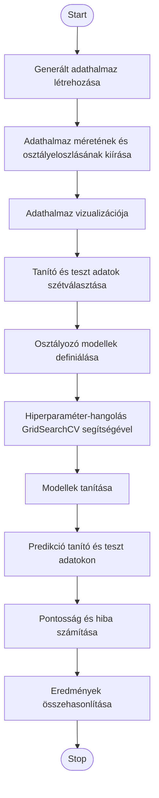
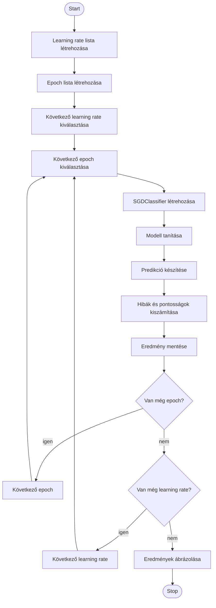
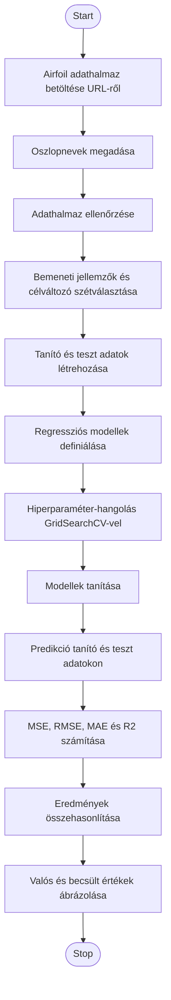

# MI Machine Learning

[Documentation](https://github.com/makkmarci13/mi_machine_learning/blob/master/documentation.pdf)

## Generált klasszifikációs feladat

### Pszeudokód

```
Bemenet: generált klasszifikációs paraméterek
Kimenet: modellek teljesítményének összehasonlítása

1. Generáljuk le az adathalmazt a megadott paraméterekkel.
2. Írjuk ki az adathalmaz méretét és az osztályeloszlást.
3. Ábrázoljuk az adathalmazt az első két jellemző alapján.
4. Osszuk fel az adatokat tanító és teszt halmazra.
5. Definiáljuk a három osztályozó modellt:
   - Naive Bayes
   - Random Forest
   - K-Nearest Neighbors
6. Minden modell esetén:
   6.1. Végezzük el a hiperparaméter-hangolást, ha van hangolandó paraméter.
   6.2. Tanítsuk be a modellt a tanító adatokon.
   6.3. Készítsünk predikciót a tanító és teszt adatokon.
   6.4. Számítsuk ki a pontosságot.
   6.5. Számítsuk ki a tanítási és tesztelési hibát.
7. Hasonlítsuk össze az eredményeket táblázatos formában.
8. Ábrázoljuk a tanulási görbéket.
```

### UML



## Learning rate és epoch vizsgálat

### Pszeudokód

```
Bemenet: tanító és teszt adatok, learning rate lista, epoch lista
Kimenet: learning rate és epoch kombinációk eredményei

1. Hozzuk létre a learning rate értékek listáját.
2. Hozzuk létre az epoch értékek listáját.
3. Minden learning rate értékre:
   3.1. Minden epoch értékre:
        3.1.1. Hozzunk létre egy SGDClassifier modellt.
        3.1.2. Állítsuk be az aktuális learning rate és epoch értéket.
        3.1.3. Tanítsuk be a modellt a tanító adatokon.
        3.1.4. Készítsünk predikciót a tanító és teszt adatokon.
        3.1.5. Számítsuk ki a tanítási és teszt pontosságot.
        3.1.6. Számítsuk ki a tanítási és teszt hibát.
        3.1.7. Mentsük el az eredményt.
4. Rendezzük és jelenítsük meg az eredményeket.
5. Ábrázoljuk a learning rate és epoch hatását.
```

### UML



## Valós adathalmazos regressziós feladat

### Pszeudokód

```
Bemenet: Airfoil Self-Noise adathalmaz
Kimenet: regressziós modellek kiértékelése

1. Töltsük be az Airfoil Self-Noise adathalmazt külső URL-ről.
2. Adjunk neveket az oszlopoknak.
3. Ellenőrizzük az adathalmaz méretét és adattípusait.
4. Válasszuk szét a bemeneti jellemzőket és a célváltozót.
5. Osszuk fel az adatokat tanító és teszt halmazra.
6. Definiáljuk a regressziós modelleket.
7. Minden regressziós modell esetén:
   7.1 Ha szükséges, végezzünk skálázást.
   7.2 Ha vannak hiperparaméterek, végezzünk GridSearchCV hangolást.
   7.3 Tanítsuk be a modellt.
   7.4 Készítsünk predikciót a tanító és teszt adatokon.
   7.5 Számítsuk ki az MSE, RMSE, MAE és R2 értékeket.
   7.6 Mentsük el az eredményeket.
8. Hasonlítsuk össze a modelleket táblázatos formában.
9. Ábrázoljuk a valós és becsült értékeket.
```

### UML



